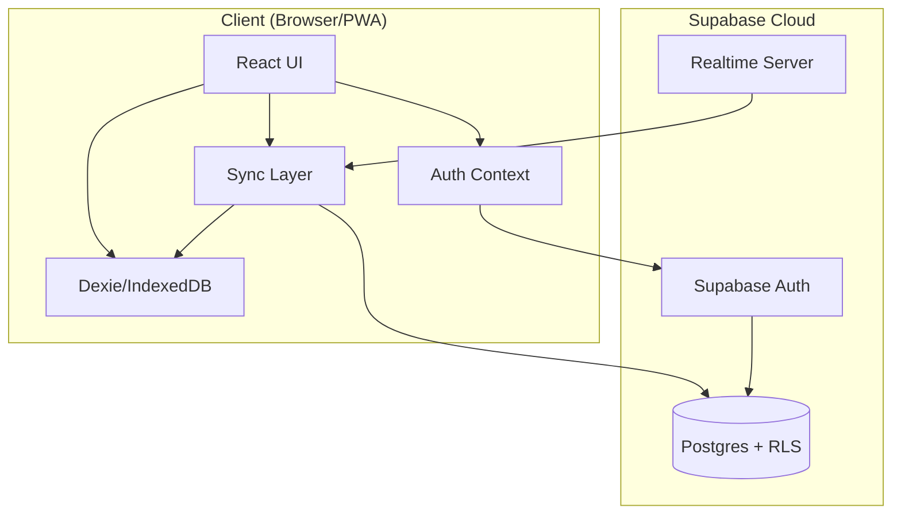
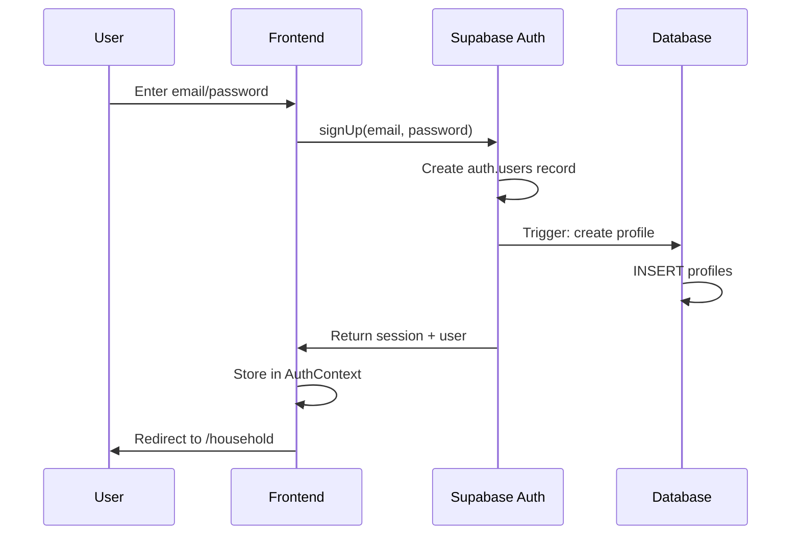
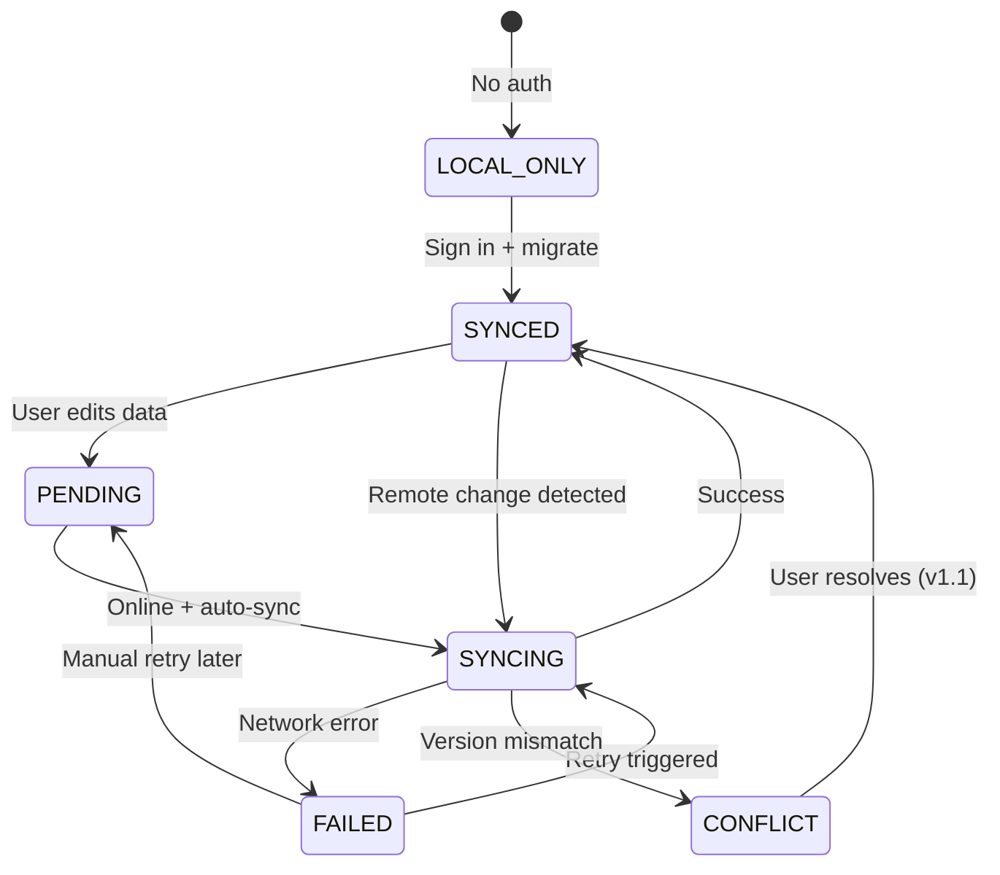
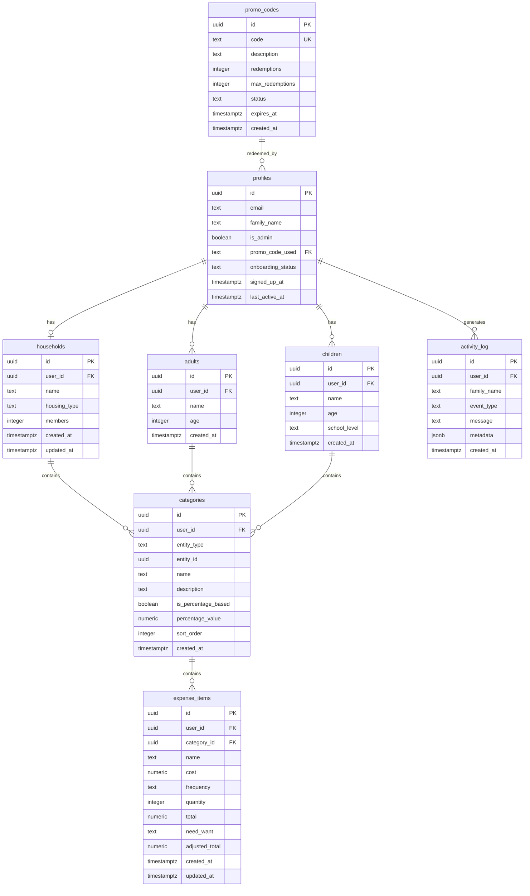

# My Balanced Family Finances — Engineering Document

**Date:** August 7, 2026  
**Author:** Engineering Team  
**Status:** Draft  
**Version:** 1.0  
**Based on:** PRD v1.1 (User Adoption MVP)

---

## Table of Contents

1. [Executive Summary](#1-executive-summary)
2. [Product Scope](#2-product-scope)
3. [User Personas](#3-user-personas)
4. [User Flows](#4-user-flows)
5. [Frontend Architecture](#5-frontend-architecture)
6. [Backend Architecture](#6-backend-architecture)
7. [Sync State Machine](#7-sync-state-machine)
8. [Error Handling Strategy](#8-error-handling-strategy)
9. [Database Design](#9-database-design)
10. [API Specification](#10-api-specification)
11. [Feature Breakdown](#11-feature-breakdown)
12. [Folder Structure](#12-folder-structure)
13. [Naming Conventions](#13-naming-conventions)
14. [Testing Strategy](#14-testing-strategy)
15. [Specs to Implementation Mapping](#15-specs-to-implementation-mapping)

---

## 1. Executive Summary

### Project Name
My Balanced Family Finances

### Business Goal
Drive user adoption by enabling Australian families to understand their true annual cost of living through a structured, category-based budgeting tool. Free access for all users (Founding Members, invite only).

### Problem Statement
Australian families underestimate their annual expenses by 20-40% due to fragmented costs across different people (children, adults), frequencies (weekly, term, annual), and priorities (needs vs wants). Existing tools focus on transaction tracking, not forward planning.

### Target Users
1. **Organised Parents** — Primary users managing family budgets
2. **Financial Coaches** — Secondary users running workshops
3. **New Parents** — Tertiary users needing expense frameworks

### Success Criteria
| Metric | Target | Timeline |
|--------|--------|----------|
| Budget completion rate | ≥ 40% complete all 3 entities | 30 days post-signup |
| Time to first entry | ≤ 5 minutes from signup | Immediate |
| Monthly active users | ≥ 60% of registered users | Ongoing |
| Forward planning engagement | ≥ 25% try planning mode | 30 days |

---

## 2. Product Scope

### In Scope (MVP v1.0)

| Feature | Description | Priority |
|---------|-------------|----------|
| User Authentication | Email/password signup and signin via Supabase Auth | P0 |
| Profile Management | CRUD for households, adults, children | P0 |
| Budget Entry | Categories with expense items (cost, frequency, quantity) | P0 |
| Dashboard | Annual totals, per-entity breakdowns, charts | P0 |
| Planning Mode | Needs/wants tagging, forward adjustments | P1 |
| Data Sync | IndexedDB ↔ Supabase bidirectional sync | P0 |
| Admin Panel | User management, promo codes, activity log, family details | P0 |
| Offline Support | Full functionality with IndexedDB, sync when online | P0 |

### Out of Scope (Deferred)

| Feature | Deferred To | Reason |
|---------|-------------|--------|
| Payment Processing (Stripe) | Future | Client feedback: focus on adoption first |
| Social Auth (Google) | v1.1 | Nice-to-have, not critical for launch |
| Email Notifications | v1.1 | Manual communication sufficient initially |
| Native Mobile Apps | Future | PWA provides adequate mobile experience |
| Multi-admin Workspace | Future | Single founder admin sufficient for launch |

### Future Enhancements (v1.1+)

- Social authentication (Google OAuth)
- Welcome email on signup
- Coaching features for financial advisors
- Data export (CSV/JSON) for GDPR compliance
- Push notifications for budget reminders

---

## 3. User Personas

### 3.1 The Organised Parent (Primary)

| Attribute | Detail |
|-----------|--------|
| Demographics | 30–45 years old, 2–4 person household, 1–3 children |
| Income | $80,000–$180,000 combined |
| Behaviour | Reviews finances monthly, uses spreadsheets or mental math |
| Pain Points | Irregular expenses cause surprises, no per-child visibility |
| Primary Workflows | Budget entry, dashboard review, planning mode |

### 3.2 The Financial Coach (Secondary)

| Attribute | Detail |
|-----------|--------|
| Role | Financial counsellor, workshop facilitator |
| Behaviour | Runs 4–10 budgeting sessions per month |
| Pain Points | Existing tools require account setup before use |
| Primary Workflows | Demo budgets, view client progress via admin panel |

### 3.3 The New Parent (Tertiary)

| Attribute | Detail |
|-----------|--------|
| Demographics | First child under 3 |
| Behaviour | Shocked by childcare costs, uncertain about future expenses |
| Pain Points | No framework for "normal" family spending |
| Primary Workflows | Budget entry with pre-populated templates |

### 3.4 Permissions Matrix

| Role | App Access | Admin Access | Can Modify User Data |
|------|------------|--------------|----------------------|
| Guest (no account) | Full (IndexedDB only) | None | Own data only |
| Registered User | Full (synced) | None | Own data only |
| Admin | Full (synced) | Full (read-only on user budgets) | Own data + promo codes |

---

## 4. User Flows

### 4.1 New User Signup Flow

```
User Action              → Frontend Behavior           → Backend Processing        → Database Interaction       → System Response
─────────────────────────────────────────────────────────────────────────────────────────────────────────────────────────────────
Click "Get Started"      → Navigate to /signup         → —                         → —                          → Render signup form
Enter email/password     → Validate input              → —                         → —                          → Enable submit button
Enter promo code         → Call validatePromoCode()    → Check promo_codes table   → SELECT WHERE code = ?      → Show valid/invalid badge
Click "Create Account"   → Call supabase.auth.signUp() → Create auth.users record  → INSERT auth.users          → Return session token
—                        → Create profile record       → Trigger on auth.users     → INSERT profiles            → Profile created
—                        → Check IndexedDB for data    → —                         → —                          → Prompt "Import existing?"
Click "Yes, import"      → Batch read from IndexedDB   → —                         → —                          → Prepare migration payload
—                        → Call sync.migrateToCloud()  → Batch insert              → INSERT households, etc.    → Data migrated
—                        → Navigate to /household      → Log activity              → INSERT activity_log        → Render onboarding
```

### 4.2 Returning User Login Flow

```
User Action              → Frontend Behavior           → Backend Processing        → Database Interaction       → System Response
─────────────────────────────────────────────────────────────────────────────────────────────────────────────────────────────────
Navigate to /login       → Render login form           → —                         → —                          → Show email/password fields
Enter credentials        → Validate input              → —                         → —                          → Enable submit button
Click "Sign In"          → Call supabase.auth.signIn() → Verify credentials        → SELECT auth.users          → Return session + user
—                        → Store session in context    → Update last_active_at     → UPDATE profiles            → Session established
—                        → Call sync.pullFromCloud()   → Fetch user data           → SELECT * WHERE user_id = ? → Populate IndexedDB
—                        → Navigate to /dashboard      → Log activity              → INSERT activity_log        → Render dashboard
```

### 4.3 Budget Entry Flow

```
User Action              → Frontend Behavior           → Backend Processing        → Database Interaction       → System Response
─────────────────────────────────────────────────────────────────────────────────────────────────────────────────────────────────
Navigate to /categories  → Load child + categories     → —                         → Dexie: get categories      → Render category list
Click category           → Expand to show items        → —                         → Dexie: get items           → Render item table
Edit item cost           → Update local state          → —                         → —                          → Recalculate total
—                        → Debounce 500ms              → —                         → Dexie: put item            → Mark as DIRTY
—                        → Trigger sync if online      → Upsert to Supabase        → UPSERT expense_items       → Mark as SYNCED
Tab to next field        → Auto-save previous          → —                         → —                          → Continue editing
Add new item             → Insert empty row            → —                         → Dexie: add item            → Focus new row
Delete item              → Confirm dialog              → —                         → Dexie: delete item         → Remove from list
—                        → Trigger sync if online      → Delete from Supabase      → DELETE expense_items       → Mark as SYNCED
```

### 4.4 Planning Mode Flow

```
User Action              → Frontend Behavior           → Backend Processing        → Database Interaction       → System Response
─────────────────────────────────────────────────────────────────────────────────────────────────────────────────────────────────
Navigate to /planning    → Load all expense items      → —                         → Dexie: get all items       → Render planning view
Toggle Need/Want         → Update item.needWant        → —                         → Dexie: put item            → Highlight as need/want
Adjust amount            → Update item.adjustedTotal   → —                         → Dexie: put item            → Show original vs adjusted
—                        → Recalculate savings         → —                         → —                          → Display savings amount
Click "Reset"            → Confirm dialog              → —                         → Dexie: clear adjustedTotal → Restore original values
Click "Save Plan"        → Sync all changes            → Batch upsert              → UPSERT expense_items       → Show success toast
```

### 4.5 Admin User Management Flow

```
User Action              → Frontend Behavior           → Backend Processing        → Database Interaction       → System Response
─────────────────────────────────────────────────────────────────────────────────────────────────────────────────────────────────
Navigate to /admin       → Check is_admin flag         → Verify via RLS            → SELECT profiles            → Allow or redirect
—                        → Load users list             → Query with admin RLS      → SELECT profiles (all)      → Render users table
Click family row         → Navigate to /admin/families/[id] → —                    → —                          → Load family detail
—                        → Fetch profile + budget      → Query with admin RLS      → SELECT profiles, budgets   → Render read-only view
Filter by status         → Update query params         → —                         → —                          → Re-fetch filtered list
Search by name           → Debounce + filter           → —                         → —                          → Show matching results
```

### 4.6 Admin Promo Code Flow

```
User Action              → Frontend Behavior           → Backend Processing        → Database Interaction       → System Response
─────────────────────────────────────────────────────────────────────────────────────────────────────────────────────────────────
Click "Create Code"      → Open dialog                 → —                         → —                          → Render form
Enter code details       → Validate uniqueness         → Check existing codes      → SELECT promo_codes         → Show available/taken
Click "Save"             → Call supabase.insert()      → Insert via admin RLS      → INSERT promo_codes         → Close dialog, refresh
Click "Edit" on row      → Open dialog with data       → —                         → —                          → Render edit form
Update and save          → Call supabase.update()      → Update via admin RLS      → UPDATE promo_codes         → Show updated row
Click "Expire"           → Confirm dialog              → —                         → —                          → Show confirmation
Confirm expiry           → Set status = 'expired'      → Update via admin RLS      → UPDATE promo_codes         → Grey out row
```

### 4.7 Data Sync Flow (Offline to Online)

```
Event                    → Frontend Behavior           → Backend Processing        → Database Interaction       → System Response
─────────────────────────────────────────────────────────────────────────────────────────────────────────────────────────────────
User goes offline        → Detect via navigator.onLine → —                         → —                          → Show offline indicator
User edits data          → Save to IndexedDB           → —                         → Dexie: put with DIRTY flag → Queue for sync
User comes online        → Detect online event         → —                         → —                          → Trigger sync
—                        → Get all DIRTY records       → —                         → Dexie: where sync = DIRTY  → Build sync payload
—                        → Set state to SYNCING        → —                         → —                          → Show syncing indicator
—                        → Call supabase.upsert()      → Batch upsert              → UPSERT tables              → Return success/error
Success                  → Mark records SYNCED         → —                         → Dexie: update sync flag    → Hide indicator
Failure                  → Mark records FAILED         → —                         → Dexie: update sync flag    → Show retry button
—                        → Schedule retry (exp backoff)→ —                         → —                          → Retry after delay
```

---

## 5. Frontend Architecture

### 5.1 Technology Stack

| Layer | Technology | Version | Purpose |
|-------|------------|---------|---------|
| Framework | Next.js | 16.x | App Router, SSR, file-based routing |
| UI Library | React | 19.x | Component-based UI |
| Styling | Tailwind CSS | 4.x | Utility-first CSS |
| Components | shadcn/ui + Radix | Latest | Accessible, customisable primitives |
| Charts | Recharts | Latest | Data visualisation |
| Local Storage | Dexie | 4.x | IndexedDB wrapper with reactive queries |
| State | React hooks | — | useState, useEffect, useContext |
| Forms | Native | — | Controlled components |

### 5.2 Page Hierarchy

```
app/
├── page.tsx                    # Landing page (/)
├── signup/page.tsx             # User registration (/signup)
├── login/page.tsx              # User login (/login) — TO BUILD
├── household/page.tsx          # Household setup (/household)
├── children/page.tsx           # Manage children (/children)
├── adults/page.tsx             # Manage adults (/adults)
├── dashboard/page.tsx          # Main dashboard (/dashboard)
├── categories/page.tsx         # Child budget entry (/categories)
├── adult-categories/page.tsx   # Adult budget entry (/adult-categories)
├── household-categories/page.tsx # Household budget (/household-categories)
├── planning/page.tsx           # Planning mode (/planning)
├── summary/page.tsx            # Budget summary (/summary)
└── admin/
    ├── login/page.tsx          # Admin login (/admin/login)
    ├── page.tsx                # Admin dashboard (/admin)
    ├── families/[id]/page.tsx  # Family detail (/admin/families/[id])
    └── components/
        ├── users-tab.tsx
        ├── promo-codes-tab.tsx
        ├── activity-tab.tsx
        └── subscriptions-tab.tsx
```

### 5.3 Component Architecture

```
components/
├── ui/                         # shadcn/ui primitives (50+ components)
│   ├── button.tsx
│   ├── card.tsx
│   ├── dialog.tsx
│   ├── table.tsx
│   └── ...
├── page-header.tsx             # Shared page header
├── bottom-nav.tsx              # Mobile navigation
├── theme-provider.tsx          # Theme context
├── auth-provider.tsx           # Auth context — TO BUILD
├── sync-provider.tsx           # Sync state context — TO BUILD
└── [feature]/                  # Feature-specific components — TO BUILD
    ├── budget-item-row.tsx
    ├── category-card.tsx
    └── sync-status-indicator.tsx
```

### 5.4 UX States

Every data-driven component must handle these states:

| State | Trigger | UI Treatment |
|-------|---------|--------------|
| **Loading** | Initial fetch, sync in progress | Skeleton or spinner |
| **Empty** | No data exists | Illustration + CTA to add |
| **Error** | Fetch failed, sync failed | Error message + retry button |
| **Success** | Data loaded | Render content |
| **Offline** | navigator.onLine = false | Offline banner + local data |

### 5.5 Responsive Breakpoints

| Breakpoint | Width | Layout |
|------------|-------|--------|
| Mobile | < 640px | Single column, bottom nav |
| Tablet | 640px – 1024px | Two columns where appropriate |
| Desktop | > 1024px | Full layout, sidebar nav |

---

## 6. Backend Architecture

### 6.1 Technology Stack

| Layer | Technology | Purpose |
|-------|------------|---------|
| Auth | Supabase Auth | Email/password authentication, JWT tokens |
| Database | Supabase Postgres | Primary data store with RLS |
| Realtime | Supabase Realtime | Push updates to connected clients |
| Storage | Supabase Storage | Future: file uploads (not MVP) |
| Functions | Supabase Edge Functions | Future: custom logic (not MVP) |

### 6.2 System Architecture Diagram



### 6.3 Service Interaction

| Service | Responsibilities |
|---------|------------------|
| **Auth Context** | Session management, user state, protected routes |
| **Sync Layer** | Bidirectional sync, conflict resolution, queue management |
| **Dexie** | Local persistence, reactive queries, offline storage |
| **Supabase Client** | API calls, realtime subscriptions |

### 6.4 Authentication Flow



---

## 7. Sync State Machine

### 7.1 State Definitions

| State | Description | UI Indicator |
|-------|-------------|--------------|
| `LOCAL_ONLY` | User not logged in, data in IndexedDB only | "Sign in to sync" prompt |
| `SYNCED` | All local data matches cloud | Green checkmark (optional) |
| `PENDING` | Changes made, queued for sync | Yellow dot |
| `SYNCING` | Currently uploading/downloading | Spinner + "Syncing..." |
| `FAILED` | Sync attempt failed | Red warning + "Retry" |
| `CONFLICT` | Same record modified elsewhere | "Resolve conflict" dialog (v1.1) |

### 7.2 State Diagram



### 7.3 Transition Triggers

| From | To | Trigger |
|------|-----|---------|
| LOCAL_ONLY | SYNCED | User signs in and migrates data |
| SYNCED | PENDING | User creates/updates/deletes any record |
| PENDING | SYNCING | Online detected + debounce timer expires |
| SYNCING | SYNCED | Supabase upsert returns success |
| SYNCING | FAILED | Network error or Supabase error |
| FAILED | SYNCING | Retry timer expires or user clicks retry |

### 7.4 Implementation: Sync Record Schema

Each record in IndexedDB has sync metadata:

```typescript
interface SyncMeta {
  syncStatus: 'LOCAL_ONLY' | 'SYNCED' | 'PENDING' | 'FAILED';
  lastModified: number;      // Local timestamp
  lastSynced: number | null; // Cloud timestamp
  syncAttempts: number;      // For exponential backoff
  cloudId: string | null;    // Supabase UUID
}
```

### 7.5 Conflict Resolution Strategy (MVP)

**Strategy:** Last-write-wins based on `lastModified` timestamp.

```typescript
function resolveConflict(local: Record, remote: Record): Record {
  // MVP: Simple last-write-wins
  return local.lastModified > remote.lastModified ? local : remote;
}
```

**Future (v1.1):** Present both versions to user with diff view.

---

## 8. Error Handling Strategy

### 8.1 Error Categories

| Category | Examples | Severity | User Action Required |
|----------|----------|----------|----------------------|
| **Network** | Offline, timeout, DNS failure | Recoverable | Wait or retry |
| **Auth** | Invalid token, session expired | Recoverable | Re-login |
| **Validation** | Invalid input, constraint violation | Recoverable | Fix input |
| **Server** | 500 errors, Supabase down | Recoverable | Retry later |
| **Client** | JavaScript error, render failure | Critical | Refresh page |

### 8.2 Error Boundary Structure

```typescript
// app/layout.tsx
<ErrorBoundary fallback={<GlobalErrorFallback />}>
  <AuthProvider>
    <SyncProvider>
      {children}
    </SyncProvider>
  </AuthProvider>
</ErrorBoundary>
```

### 8.3 Error Notification Patterns

| Error Type | Notification | Duration | Action |
|------------|--------------|----------|--------|
| Sync failed | Toast (warning) | 5 seconds | "Retry" button |
| Auth expired | Toast (info) | Persistent | "Sign in" link |
| Validation | Inline message | Until fixed | Highlight field |
| Server error | Toast (error) | 5 seconds | "Try again" button |
| Offline | Banner (top) | While offline | None (auto-dismiss) |

### 8.4 Retry Strategy

```typescript
const RETRY_CONFIG = {
  maxAttempts: 3,
  baseDelayMs: 1000,
  maxDelayMs: 30000,
  backoffMultiplier: 2,
};

function getRetryDelay(attempt: number): number {
  const delay = RETRY_CONFIG.baseDelayMs * Math.pow(RETRY_CONFIG.backoffMultiplier, attempt);
  return Math.min(delay, RETRY_CONFIG.maxDelayMs);
}

// Retry schedule: 1s → 2s → 4s → give up
```

### 8.5 Offline Detection

```typescript
// lib/sync.ts
function initOfflineDetection() {
  window.addEventListener('online', () => {
    setSyncState('PENDING');
    triggerSync();
  });
  
  window.addEventListener('offline', () => {
    showOfflineBanner();
  });
}
```

### 8.6 Error Logging (Future)

MVP: Console.error for debugging.
v1.1: Integrate Sentry for production error tracking.

```typescript
// Future implementation
function logError(error: Error, context: Record<string, unknown>) {
  console.error('[Error]', error.message, context);
  // Sentry.captureException(error, { extra: context });
}
```

---

## 9. Database Design

### 9.1 Entity Relationship Diagram



### 9.2 Table Specifications

#### profiles

| Column | Type | Constraints | Description |
|--------|------|-------------|-------------|
| id | UUID | PK, FK → auth.users | User identifier |
| email | TEXT | NOT NULL | User email |
| family_name | TEXT | | Family display name |
| is_admin | BOOLEAN | DEFAULT FALSE | Admin flag |
| promo_code_used | TEXT | | Attribution tracking |
| onboarding_status | TEXT | DEFAULT 'signed_up' | Progress tracking |
| signed_up_at | TIMESTAMPTZ | DEFAULT NOW() | Registration time |
| last_active_at | TIMESTAMPTZ | DEFAULT NOW() | Last activity |

**Indexes:**
- `idx_profiles_email` ON (email)
- `idx_profiles_is_admin` ON (is_admin) WHERE is_admin = TRUE

#### households

| Column | Type | Constraints | Description |
|--------|------|-------------|-------------|
| id | UUID | PK, DEFAULT gen_random_uuid() | Household identifier |
| user_id | UUID | FK → profiles, ON DELETE CASCADE | Owner |
| name | TEXT | NOT NULL | Household name |
| housing_type | TEXT | | Rent/Own/etc |
| members | INTEGER | DEFAULT 1 | Member count |
| created_at | TIMESTAMPTZ | DEFAULT NOW() | Creation time |
| updated_at | TIMESTAMPTZ | DEFAULT NOW() | Last update |

**Indexes:**
- `idx_households_user_id` ON (user_id)

#### categories

| Column | Type | Constraints | Description |
|--------|------|-------------|-------------|
| id | UUID | PK, DEFAULT gen_random_uuid() | Category identifier |
| user_id | UUID | FK → profiles, ON DELETE CASCADE | Owner |
| entity_type | TEXT | NOT NULL | 'child', 'adult', 'household' |
| entity_id | UUID | NOT NULL | FK to child/adult/household |
| name | TEXT | NOT NULL | Category name |
| description | TEXT | | Category description |
| is_percentage_based | BOOLEAN | DEFAULT FALSE | Percentage calc flag |
| percentage_value | NUMERIC | DEFAULT 15 | Percentage if applicable |
| sort_order | INTEGER | DEFAULT 0 | Display order |
| created_at | TIMESTAMPTZ | DEFAULT NOW() | Creation time |

**Indexes:**
- `idx_categories_user_entity` ON (user_id, entity_type, entity_id)

#### expense_items

| Column | Type | Constraints | Description |
|--------|------|-------------|-------------|
| id | UUID | PK, DEFAULT gen_random_uuid() | Item identifier |
| user_id | UUID | FK → profiles, ON DELETE CASCADE | Owner |
| category_id | UUID | FK → categories, ON DELETE CASCADE | Parent category |
| name | TEXT | NOT NULL | Item name |
| cost | NUMERIC | DEFAULT 0 | Unit cost |
| frequency | TEXT | DEFAULT 'monthly' | weekly/monthly/term/annual |
| quantity | INTEGER | DEFAULT 1 | Quantity |
| total | NUMERIC | DEFAULT 0 | Calculated annual total |
| need_want | TEXT | | 'need', 'want', or null |
| adjusted_total | NUMERIC | | Planning mode adjustment |
| created_at | TIMESTAMPTZ | DEFAULT NOW() | Creation time |
| updated_at | TIMESTAMPTZ | DEFAULT NOW() | Last update |

**Indexes:**
- `idx_expense_items_category` ON (category_id)
- `idx_expense_items_user` ON (user_id)

### 9.3 Row Level Security Policies

```sql
-- Enable RLS on all tables
ALTER TABLE profiles ENABLE ROW LEVEL SECURITY;
ALTER TABLE households ENABLE ROW LEVEL SECURITY;
ALTER TABLE adults ENABLE ROW LEVEL SECURITY;
ALTER TABLE children ENABLE ROW LEVEL SECURITY;
ALTER TABLE categories ENABLE ROW LEVEL SECURITY;
ALTER TABLE expense_items ENABLE ROW LEVEL SECURITY;
ALTER TABLE promo_codes ENABLE ROW LEVEL SECURITY;
ALTER TABLE activity_log ENABLE ROW LEVEL SECURITY;

-- Users can only access their own data
CREATE POLICY "Users can view own profile" 
  ON profiles FOR SELECT 
  USING (auth.uid() = id);

CREATE POLICY "Users can update own profile" 
  ON profiles FOR UPDATE 
  USING (auth.uid() = id);

CREATE POLICY "Users can CRUD own households" 
  ON households FOR ALL 
  USING (auth.uid() = user_id);

CREATE POLICY "Users can CRUD own adults" 
  ON adults FOR ALL 
  USING (auth.uid() = user_id);

CREATE POLICY "Users can CRUD own children" 
  ON children FOR ALL 
  USING (auth.uid() = user_id);

CREATE POLICY "Users can CRUD own categories" 
  ON categories FOR ALL 
  USING (auth.uid() = user_id);

CREATE POLICY "Users can CRUD own items" 
  ON expense_items FOR ALL 
  USING (auth.uid() = user_id);

-- Admins can read all user data (but not modify)
CREATE POLICY "Admins can view all profiles" 
  ON profiles FOR SELECT 
  USING (
    auth.uid() = id OR
    EXISTS (SELECT 1 FROM profiles WHERE id = auth.uid() AND is_admin = TRUE)
  );

CREATE POLICY "Admins can view all households" 
  ON households FOR SELECT 
  USING (
    auth.uid() = user_id OR
    EXISTS (SELECT 1 FROM profiles WHERE id = auth.uid() AND is_admin = TRUE)
  );

CREATE POLICY "Admins can view all adults" 
  ON adults FOR SELECT 
  USING (
    auth.uid() = user_id OR
    EXISTS (SELECT 1 FROM profiles WHERE id = auth.uid() AND is_admin = TRUE)
  );

CREATE POLICY "Admins can view all children" 
  ON children FOR SELECT 
  USING (
    auth.uid() = user_id OR
    EXISTS (SELECT 1 FROM profiles WHERE id = auth.uid() AND is_admin = TRUE)
  );

CREATE POLICY "Admins can view all categories" 
  ON categories FOR SELECT 
  USING (
    auth.uid() = user_id OR
    EXISTS (SELECT 1 FROM profiles WHERE id = auth.uid() AND is_admin = TRUE)
  );

CREATE POLICY "Admins can view all expense_items" 
  ON expense_items FOR SELECT 
  USING (
    auth.uid() = user_id OR
    EXISTS (SELECT 1 FROM profiles WHERE id = auth.uid() AND is_admin = TRUE)
  );

-- Promo codes: public read, admin write
CREATE POLICY "Anyone can view promo codes" 
  ON promo_codes FOR SELECT 
  USING (TRUE);

CREATE POLICY "Admins can manage promo codes" 
  ON promo_codes FOR ALL 
  USING (
    EXISTS (SELECT 1 FROM profiles WHERE id = auth.uid() AND is_admin = TRUE)
  );

-- Activity log: users see own, admins see all
CREATE POLICY "Users can view own activity" 
  ON activity_log FOR SELECT 
  USING (auth.uid() = user_id);

CREATE POLICY "Users can insert own activity" 
  ON activity_log FOR INSERT 
  WITH CHECK (auth.uid() = user_id);

CREATE POLICY "Admins can view all activity" 
  ON activity_log FOR SELECT 
  USING (
    EXISTS (SELECT 1 FROM profiles WHERE id = auth.uid() AND is_admin = TRUE)
  );
```

---

## 10. API Specification

### 10.1 Authentication APIs

#### Sign Up

```typescript
// Method: Supabase Client
const { data, error } = await supabase.auth.signUp({
  email: string,
  password: string,
  options: {
    data: {
      family_name: string,
      promo_code_used: string | null,
    }
  }
});

// Response (success)
{
  user: { id: uuid, email: string, ... },
  session: { access_token: string, refresh_token: string, ... }
}

// Response (error)
{
  error: { message: string, status: number }
}
```

#### Sign In

```typescript
const { data, error } = await supabase.auth.signInWithPassword({
  email: string,
  password: string,
});
```

#### Sign Out

```typescript
const { error } = await supabase.auth.signOut();
```

#### Get Session

```typescript
const { data: { session } } = await supabase.auth.getSession();
```

### 10.2 Database Operations

#### Create Household

```typescript
const { data, error } = await supabase
  .from('households')
  .insert({
    user_id: uuid,
    name: string,
    housing_type: string,
    members: number,
  })
  .select()
  .single();
```

#### Get User's Households

```typescript
const { data, error } = await supabase
  .from('households')
  .select('*')
  .eq('user_id', userId);
```

#### Upsert Expense Item

```typescript
const { data, error } = await supabase
  .from('expense_items')
  .upsert({
    id: uuid | undefined,  // undefined for new
    user_id: uuid,
    category_id: uuid,
    name: string,
    cost: number,
    frequency: string,
    quantity: number,
    total: number,
    need_want: string | null,
    adjusted_total: number | null,
    updated_at: new Date().toISOString(),
  })
  .select()
  .single();
```

#### Batch Upsert (Sync)

```typescript
const { data, error } = await supabase
  .from('expense_items')
  .upsert(items, { onConflict: 'id' })
  .select();
```

#### Delete Expense Item

```typescript
const { error } = await supabase
  .from('expense_items')
  .delete()
  .eq('id', itemId);
```

### 10.3 Admin Queries

#### Get All Users (Admin)

```typescript
// RLS automatically filters based on is_admin flag
const { data, error } = await supabase
  .from('profiles')
  .select(`
    *,
    households (*),
    children (*),
    adults (*)
  `)
  .order('signed_up_at', { ascending: false });
```

#### Get User Budget Summary (Admin)

```typescript
const { data, error } = await supabase
  .from('expense_items')
  .select(`
    *,
    categories (
      name,
      entity_type,
      entity_id
    )
  `)
  .eq('user_id', targetUserId);
```

### 10.4 Realtime Subscriptions

```typescript
// Subscribe to changes in user's expense items
const subscription = supabase
  .channel('expense_items_changes')
  .on(
    'postgres_changes',
    {
      event: '*',
      schema: 'public',
      table: 'expense_items',
      filter: `user_id=eq.${userId}`,
    },
    (payload) => {
      handleRemoteChange(payload);
    }
  )
  .subscribe();

// Cleanup
subscription.unsubscribe();
```

---

## 11. Feature Breakdown

### Phase 1: MVP (Days 1-7)

| Feature | Description | Acceptance Criteria | Dependencies |
|---------|-------------|---------------------|--------------|
| **F1.1** Supabase Setup | Create project, configure auth | Project accessible, auth enabled | None |
| **F1.2** Database Schema | Create all tables with RLS | All tables exist, RLS verified | F1.1 |
| **F1.3** User Auth | Sign up, sign in, sign out | Auth flow works end-to-end | F1.1, F1.2 |
| **F1.4** Auth Context | React context for auth state | Session persists across pages | F1.3 |
| **F1.5** Protected Routes | Redirect unauthenticated users | Non-auth users go to /login | F1.4 |
| **F1.6** Sync Layer | IndexedDB ↔ Supabase sync | Data syncs within 2 seconds | F1.2, F1.4 |
| **F1.7** Migration Flow | Import existing IndexedDB data | Prompt shown, data migrated | F1.6 |
| **F1.8** Admin Auth | Admin role check | Admin-only routes protected | F1.4 |
| **F1.9** Admin Real Data | Replace mock with DB queries | Admin sees real users | F1.2, F1.8 |
| **F1.10** Promo Codes DB | Store codes in Supabase | Codes persist, redemptions tracked | F1.2 |

### Phase 2: Post-Launch (v1.1)

| Feature | Description | Acceptance Criteria | Dependencies |
|---------|-------------|---------------------|--------------|
| **F2.1** Google Auth | Social login option | Users can sign in with Google | F1.3 |
| **F2.2** Welcome Email | Send email on signup | Email received within 1 minute | F1.3 |
| **F2.3** Conflict Resolution UI | Show both versions on conflict | User can choose version | F1.6 |
| **F2.4** Error Monitoring | Sentry integration | Errors captured in dashboard | F1.* |
| **F2.5** Analytics | PostHog integration | Events tracked, funnels visible | F1.* |

### Phase 3: Future

| Feature | Description | Acceptance Criteria | Dependencies |
|---------|-------------|---------------------|--------------|
| **F3.1** Payment Integration | Stripe subscriptions | Users can subscribe | F2.* |
| **F3.2** Multi-Admin | Multiple admin users | Team can share admin access | F1.8 |
| **F3.3** Data Export | CSV/JSON export | User downloads all their data | F1.6 |
| **F3.4** Push Notifications | Budget reminders | Notifications received on mobile | F2.* |

---

## 12. Folder Structure

```
family-budgeting-tool/
├── app/                              # Next.js App Router
│   ├── layout.tsx                    # Root layout with providers
│   ├── page.tsx                      # Landing page
│   ├── globals.css                   # Global styles
│   ├── (auth)/                       # Auth route group
│   │   ├── signup/page.tsx
│   │   ├── login/page.tsx            # TO BUILD
│   │   └── layout.tsx                # Auth layout (no nav)
│   ├── (app)/                        # Protected route group
│   │   ├── household/page.tsx
│   │   ├── children/page.tsx
│   │   ├── adults/page.tsx
│   │   ├── dashboard/page.tsx
│   │   ├── categories/page.tsx
│   │   ├── adult-categories/page.tsx
│   │   ├── household-categories/page.tsx
│   │   ├── planning/page.tsx
│   │   ├── summary/page.tsx
│   │   └── layout.tsx                # App layout with nav
│   └── admin/                        # Admin routes
│       ├── login/page.tsx
│       ├── page.tsx
│       ├── families/[id]/page.tsx
│       └── components/
│           ├── users-tab.tsx
│           ├── promo-codes-tab.tsx
│           ├── activity-tab.tsx
│           └── subscriptions-tab.tsx
├── components/
│   ├── ui/                           # shadcn/ui components
│   ├── providers/                    # Context providers — TO BUILD
│   │   ├── auth-provider.tsx
│   │   ├── sync-provider.tsx
│   │   └── theme-provider.tsx
│   ├── shared/                       # Shared components
│   │   ├── page-header.tsx
│   │   ├── bottom-nav.tsx
│   │   ├── offline-banner.tsx        # TO BUILD
│   │   └── sync-indicator.tsx        # TO BUILD
│   └── features/                     # Feature components — TO BUILD
│       ├── budget/
│       │   ├── category-card.tsx
│       │   ├── expense-item-row.tsx
│       │   └── budget-summary.tsx
│       └── admin/
│           └── family-detail-card.tsx
├── lib/
│   ├── db.ts                         # Dexie database schema
│   ├── config.ts                     # App configuration
│   ├── supabase.ts                   # Supabase client — TO BUILD
│   ├── sync.ts                       # Sync layer — TO BUILD
│   ├── admin-mock-data.ts            # Mock data (to remove)
│   ├── admin-state.ts                # Mock state (to remove)
│   └── utils/                        # Utility functions — TO BUILD
│       ├── calculations.ts           # Budget calculations
│       ├── formatters.ts             # Currency, date formatting
│       └── validators.ts             # Input validation
├── hooks/                            # Custom hooks — TO BUILD
│   ├── use-auth.ts
│   ├── use-sync.ts
│   ├── use-offline.ts
│   └── use-budget.ts
├── types/                            # TypeScript types — TO BUILD
│   ├── database.ts                   # Supabase generated types
│   ├── sync.ts                       # Sync state types
│   └── index.ts                      # Re-exports
├── docs/
│   ├── PRD_MyBalancedFamilyFinances.md
│   └── engineering/
│       └── engineering-doc.md        # This document
├── public/
│   ├── logo.jpg
│   └── icons/
├── .env.local                        # Environment variables
├── .env.example                      # Environment template
├── package.json
├── tsconfig.json
├── tailwind.config.ts
└── next.config.ts
```

---

## 13. Naming Conventions

### 13.1 Files and Folders

| Type | Convention | Example |
|------|------------|---------|
| Pages | kebab-case | `adult-categories/page.tsx` |
| Components | kebab-case | `expense-item-row.tsx` |
| Hooks | kebab-case with `use-` prefix | `use-auth.ts` |
| Utilities | kebab-case | `format-currency.ts` |
| Types | kebab-case | `database.ts` |
| Constants | kebab-case | `config.ts` |

### 13.2 Code

| Type | Convention | Example |
|------|------------|---------|
| React Components | PascalCase | `ExpenseItemRow` |
| Hooks | camelCase with `use` prefix | `useAuth()` |
| Functions | camelCase | `formatCurrency()` |
| Constants | SCREAMING_SNAKE_CASE | `MAX_CHILDREN` |
| Variables | camelCase | `totalAnnual` |
| Types/Interfaces | PascalCase | `ExpenseItem` |
| Enums | PascalCase | `SyncStatus` |

### 13.3 Database

| Type | Convention | Example |
|------|------------|---------|
| Tables | snake_case (plural) | `expense_items` |
| Columns | snake_case | `created_at` |
| Indexes | `idx_table_column` | `idx_expense_items_category` |
| Foreign Keys | `table_id` | `user_id`, `category_id` |
| Policies | Descriptive sentence | `"Users can CRUD own items"` |

### 13.4 Environment Variables

| Type | Convention | Example |
|------|------------|---------|
| Public (client) | `NEXT_PUBLIC_` prefix | `NEXT_PUBLIC_SUPABASE_URL` |
| Private (server) | No prefix | `SUPABASE_SERVICE_ROLE_KEY` |

### 13.5 Git

| Type | Convention | Example |
|------|------------|---------|
| Branches | `type/description` | `feature/auth-flow`, `fix/sync-bug` |
| Commits | Conventional commits | `feat: add user authentication` |

---

## 14. Testing Strategy

### 14.1 Test Types and Coverage

| Type | Scope | Tool | Coverage Target |
|------|-------|------|-----------------|
| Unit | Functions, utilities, calculations | Vitest | 80% |
| Integration | Supabase queries, sync layer | Vitest + Supabase local | 70% |
| E2E | Critical user flows | Playwright | 5 key flows |
| Manual | Edge cases, visual QA | Human | Before each release |

### 14.2 Unit Test Examples

```typescript
// lib/utils/calculations.test.ts
import { calculateAnnualTotal } from './calculations';

describe('calculateAnnualTotal', () => {
  it('calculates weekly frequency correctly', () => {
    expect(calculateAnnualTotal(100, 'weekly', 1)).toBe(5200);
  });
  
  it('calculates monthly frequency correctly', () => {
    expect(calculateAnnualTotal(100, 'monthly', 1)).toBe(1200);
  });
  
  it('handles quantity multiplier', () => {
    expect(calculateAnnualTotal(50, 'monthly', 2)).toBe(1200);
  });
});
```

### 14.3 Integration Test Examples

```typescript
// lib/sync.test.ts
import { createClient } from '@supabase/supabase-js';
import { syncToCloud, syncFromCloud } from './sync';

describe('Sync Layer', () => {
  it('syncs new items to cloud', async () => {
    const localItem = { id: 'temp-1', name: 'Test', cost: 100 };
    const result = await syncToCloud([localItem]);
    expect(result.success).toBe(true);
    expect(result.synced[0].id).not.toBe('temp-1'); // UUID assigned
  });
  
  it('handles offline gracefully', async () => {
    // Simulate offline
    const result = await syncToCloud([{ ... }], { simulate: 'offline' });
    expect(result.queued).toBe(true);
  });
});
```

### 14.4 E2E Test Scenarios

| Scenario | Steps | Expected Result |
|----------|-------|-----------------|
| **New User Signup** | Visit → Sign up → Complete onboarding → See dashboard | User sees empty dashboard with CTA |
| **Budget Entry** | Login → Add child → Add expense → See total | Total reflects entered amount |
| **Offline Editing** | Go offline → Edit item → Go online | Changes sync automatically |
| **Admin View** | Login as admin → View user → See budget | Read-only budget displayed |
| **Promo Code** | Create code → New user signs up with code → Check admin | Redemption count increased |

### 14.5 Test Commands

```bash
# Run all tests
npm test

# Run unit tests only
npm run test:unit

# Run integration tests (requires Supabase local)
npm run test:integration

# Run E2E tests
npm run test:e2e

# Coverage report
npm run test:coverage
```

---

## 15. Specs to Implementation Mapping

### FR-01: User Authentication

| Requirement | Users must be able to sign up, sign in, and sign out using Supabase Auth |
|-------------|--------------------------------------------------------------------------|
| **Database** | `profiles` table (auto-created via trigger) |
| **Files** | `lib/supabase.ts`, `components/providers/auth-provider.tsx`, `app/(auth)/signup/page.tsx`, `app/(auth)/login/page.tsx` |
| **Flow** | User → Signup Form → `supabase.auth.signUp()` → Trigger creates profile → Session stored in context → Redirect to app |

### FR-02: Data Sync

| Requirement | User data must sync between IndexedDB (offline) and Supabase (cloud) |
|-------------|----------------------------------------------------------------------|
| **Database** | All user tables with RLS |
| **Files** | `lib/sync.ts`, `lib/db.ts`, `components/providers/sync-provider.tsx`, `hooks/use-sync.ts` |
| **Flow** | User edits → Dexie write (PENDING) → Online detected → `syncToCloud()` → Supabase upsert → Mark SYNCED |

### FR-03: Budget Calculations

| Requirement | annual = cost × quantity × frequency multiplier |
|-------------|--------------------------------------------------|
| **Database** | `expense_items.total` (calculated on client, stored) |
| **Files** | `lib/utils/calculations.ts`, `app/(app)/categories/page.tsx` |
| **Flow** | User enters cost → `calculateAnnualTotal(cost, frequency, quantity)` → Update item.total → Display |

**Frequency Multipliers:**
- weekly: ×52
- monthly: ×12
- quarterly: ×4
- term: ×4
- annual: ×1

### FR-04: Miscellaneous Category

| Requirement | Calculate as percentage of other categories |
|-------------|---------------------------------------------|
| **Database** | `categories.is_percentage_based`, `categories.percentage_value` |
| **Files** | `lib/utils/calculations.ts`, budget entry pages |
| **Flow** | Sum non-misc categories → Apply percentage → Display misc total |

### FR-05: Admin Role Access

| Requirement | Admin users must have role-based access to admin panel |
|-------------|--------------------------------------------------------|
| **Database** | `profiles.is_admin`, RLS policies |
| **Files** | `components/providers/auth-provider.tsx`, `app/admin/layout.tsx` |
| **Flow** | User navigates to /admin → Check `is_admin` flag → Allow or redirect |

### FR-06: Promo Code Attribution

| Requirement | Track which users signed up with promo codes |
|-------------|----------------------------------------------|
| **Database** | `promo_codes`, `profiles.promo_code_used` |
| **Files** | `app/(auth)/signup/page.tsx`, `app/admin/components/promo-codes-tab.tsx` |
| **Flow** | User enters code → Validate against `promo_codes` → Store in profile → Increment redemptions |

### FR-07: Admin Read-Only

| Requirement | Admin must not be able to modify user budget data |
|-------------|---------------------------------------------------|
| **Database** | RLS policies (SELECT only for admin on budget tables) |
| **Files** | Supabase SQL migrations |
| **Flow** | Admin queries user data → RLS allows SELECT → INSERT/UPDATE/DELETE blocked |

### FR-08: Timestamps

| Requirement | Store in UTC, display in local timezone |
|-------------|------------------------------------------|
| **Database** | `TIMESTAMPTZ` columns |
| **Files** | `lib/utils/formatters.ts` |
| **Flow** | Store: `new Date().toISOString()` → Display: `Intl.DateTimeFormat(locale)` |

### FR-09: Export

| Requirement | Generate valid CSV with all budget data |
|-------------|------------------------------------------|
| **Database** | Read from all expense-related tables |
| **Files** | `lib/utils/export.ts` (TO BUILD) |
| **Flow** | User clicks export → Query all data → Generate CSV → Download |

### FR-10: Free Access

| Requirement | All users get free access — no payment required |
|-------------|--------------------------------------------------|
| **Database** | No payment tables |
| **Files** | Remove/hide payment UI |
| **Flow** | N/A — no payment flow |

---

## Appendix A: Environment Variables

```bash
# .env.local

# Supabase (required)
NEXT_PUBLIC_SUPABASE_URL=https://your-project.supabase.co
NEXT_PUBLIC_SUPABASE_ANON_KEY=eyJ...

# Supabase (server-only, for admin operations)
SUPABASE_SERVICE_ROLE_KEY=eyJ...

# App Config
NEXT_PUBLIC_APP_URL=http://localhost:3000

# Feature Flags (optional)
NEXT_PUBLIC_ENABLE_ANALYTICS=false
NEXT_PUBLIC_ENABLE_ERROR_TRACKING=false
```

---

## Appendix B: SQL Migration Script

See [docs/engineering/migrations/001_initial_schema.sql](migrations/001_initial_schema.sql) for the complete database setup script.

---

*Document version 1.0 — August 7, 2026*
